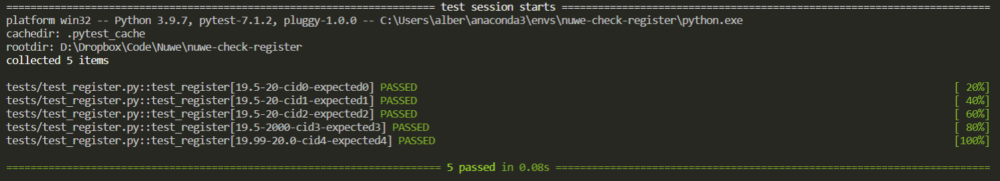

# [Check register | Logic & Structures](https://nuwe.io/dev/challenges/logic-and-structures-check-register)

## Sobre el desafio

Diseña una función checkRegister() que acepte el precio de compra como primer argumento (price), la cantidad pagada como segundo argumento (cash), y el dinero en efectivo que tiene la caja (cid) como tercer argumento.

cid es un arreglo 2D que enumera las monedas disponibles.

La función checkCashRegister() siempre debe devolver un objeto con una clave status y una clave change.

Devuelve {status: "INSUFFICIENT_FUNDS", change: []} si el efectivo en caja es menor que el cambio necesario, o si no puedes devolver el cambio exacto.

Devuelve {status: "CLOSED", change: [...]} si el efectivo en caja como valor de la clave change es igual al cambio que se debe entregar.

En cualquier otro caso, devuelve {status: "OPEN", change: [...]}, con el cambio a entregar en monedas y billetes, ordenados de mayor a menor, como valor de la clave change.

Unidad Monetaria |  Importe

Penny : $0.01 (PENNY)

Nickel : $0.05 (NICKEL)

Dime : $0.1 (DIME)

Quarter : $0.25 (QUARTER)

Dollar : $1 (ONE)

Five Dollars: $5 (FIVE)

Ten Dollars: $10 (TEN)

Twenty Dollars : $20 (TWENTY)

One-hundred Dollars : $100 (ONE HUNDRED)


## Solución
Se ha implementado una classe con el método checkRegister() que recibe el precio de compra, la cantidad pagada y el dinero en efectivo de la caja y devuelve un objeto con el estado de la caja y el cambio a entregar.

## Cómo probar el código
Para comprobar que funciona bien en todos los casos propuestos se ha implementado una batería de tests con Pytest. Además se han añadido algunos tests adicionales.

Para preparar el entorno ejecutar el siguiente comando:

```bash
conda env create -f env.yaml
conda activate nuwe-check-register
```
```

Para ejecutar los tests ejecutar el siguiente comando:

```bash
pytest -v
```
El resultado de los tests se puede ver en la captura siguiente
